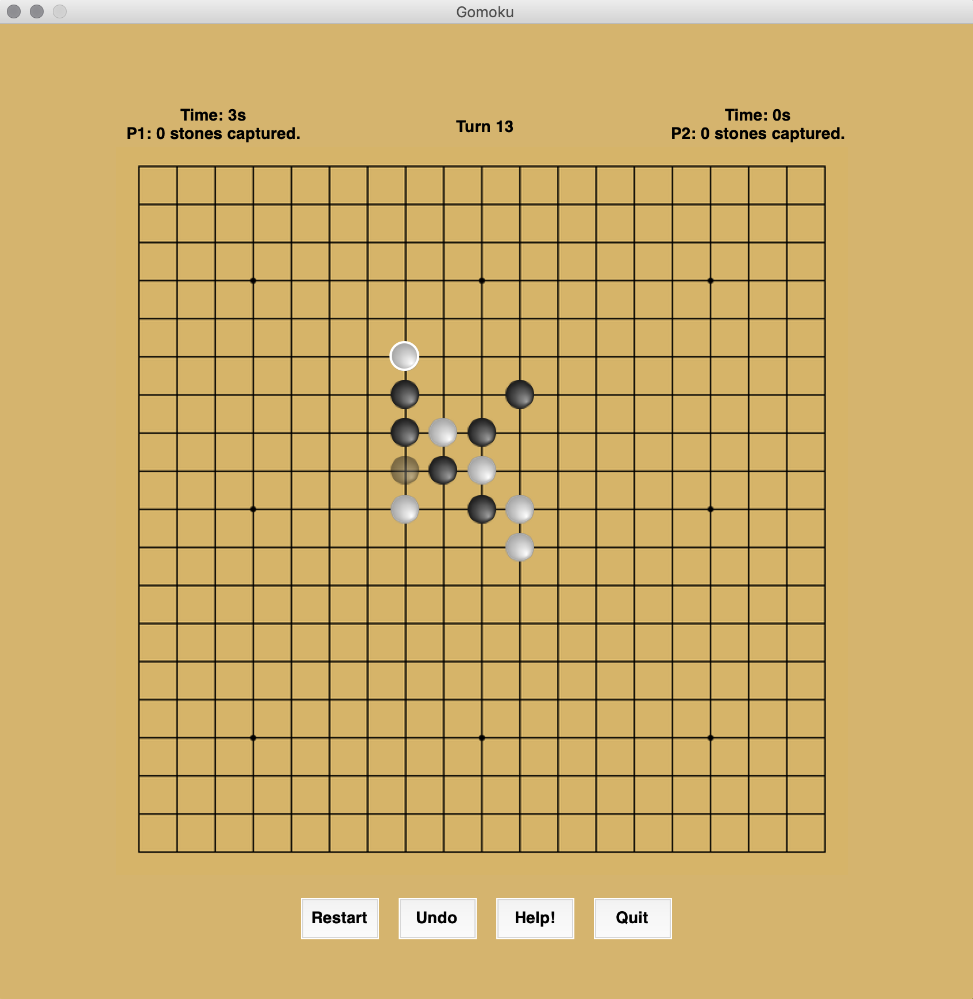

# 42 project: Gomoku
> AI bot that plays the game of Gomoku.

- The goal of the project was to implement a bot that could beat human players at the game of [Gomoku](https://en.wikipedia.org/wiki/Gomoku) with additional rules of capture and no double free threes (cf. [project description](https://github.com/mtrazzi/gomoku/blob/master/docs/gomoku.pdf)).

- We implemented [minimax](https://en.wikipedia.org/wiki/Minimax), [alpha-beta pruning](https://en.wikipedia.org/wiki/Alpha%E2%80%93beta_pruning), [MTD-f](https://en.wikipedia.org/wiki/MTD-f) and [Monte Carlo Tree Search](https://en.wikipedia.org/wiki/Monte_Carlo_tree_search).

- The main constraint was to use less than `0.5s` per move. Given these constraints, the depth of our search tree can go up to 5-6 with the simplest heuristic or 2-3 with a more complex heuristic.



## Quick Start

```sh
make
```

## Try to Beat our Bot

```sh
python -m gomoku
```

## Additional Arguments

```sh
  -h, --help            show this help message and exit
  -b BOARD, --board BOARD
                        Text file which represent a board state.
  -d, --debug           Enable terminal mode.
  -H HEURISTIC, --heuristic HEURISTIC
                        Heuristic function.
  -D {1,2,3,4,5,6,7,8,9,10}, --depth {1,2,3,4,5,6,7,8,9,10}
                        Depth of the search tree for Minimax Agents
  -p1 {human,minimax,alpha_beta,alpha_beta_memory,alpha_beta_basic,mtdf}, --player1 {human,minimax,alpha_beta,alpha_beta_memory,alpha_beta_basic,mtdf}
                        Choose Player 1 behaviour.
  -p2 {human,minimax,alpha_beta,alpha_beta_memory,alpha_beta_basic,mtdf}, --player2 {human,minimax,alpha_beta,alpha_beta_memory,alpha_beta_basic,mtdf}
                        Choose Player 2 behaviour.
  -s SCRIPT, --script SCRIPT
                        Text file to test sequence of moves.
  -c COMPETITION, --competition COMPETITION
                        Enable competition mode (max time to play).
```

## Development Setup

```sh
make dev
```

The project uses PEP8 coding style and flake8 (see setup.cfg).

## Release History

* 0.1
    * Project is mostly finished. MCTS bot is still in development, but alpha beta & mtdf work fine.

## Meta

Michaël Trazzi – [@MichaelTrazzi](https://twitter.com/michaeltrazzi) – mtrazzi@student.42.fr
Kevin Costa – [@kcosta42](https://github.com/kcosta42) – kcosta@student.42.fr

Distributed under the MIT license. See ``LICENSE`` for more information.

This project took roughly 200 [pomodoros](https://en.wikipedia.org/wiki/Pomodoro_Technique) (~100h) between December 2019 and January 2020.
